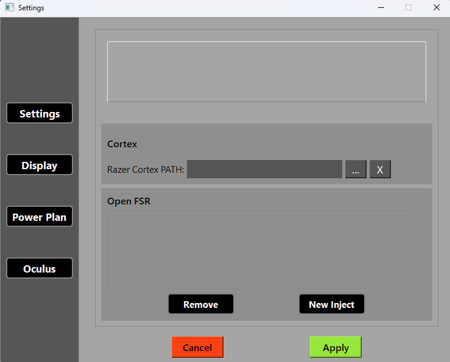
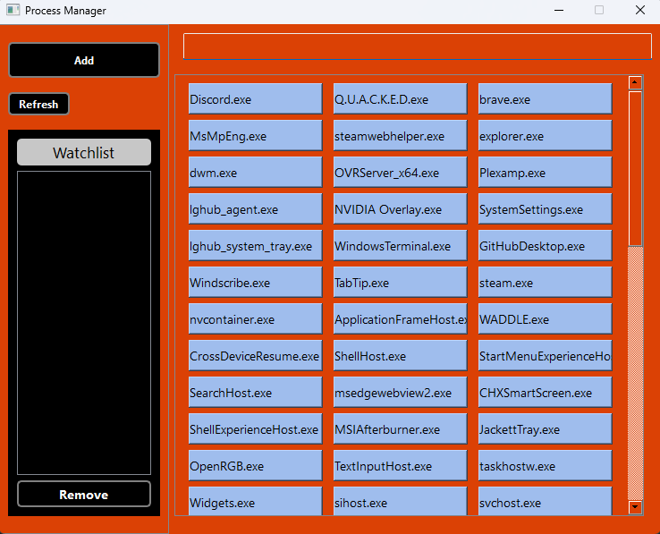

#  W.A.D.D.L.E

*We.All.Deserve.Dynamic.Lagless.Experiences, Lets you add a process to a watch list, when the process is launched W.A.D.D.L.E performs certain operating system operations.*

-----

## Table of Contents

- [Features](#features)
- [Compatibility](#compatibility)
- [Setup](#setup)
- [Run](#run)
- [Usage](#usage)
- [Contributing](#contributing)
- [License](https://github.com/donnie58744/W.A.D.D.L.E/blob/main/LICENSE)

### Features

- Automatic changing of **Power Plan** a selected power plan
- Automatic changing of **Desktop Resolution** to a selected resolution
- Automatic **Razer Cortex** ram cleaning
- Automatic **Oculus Priority Setting**
- AMD Open **FSR Injection**
- Tray Icon

### Compatibility

- Windows 10/11

### Setup

- #### Settings

  - Open the settings and enable/change optimizations

    

  - #### Process Manager

    - Shows processes with the highest CPU usage first

    - Add/Remove an process from the watch list

      

### Run

- Just double click the `WADDLE.exe`

### Usage

1. Open the Process Manager from the Tray Icon
2. Add an process to the Watchlist
3. WADDLE will perform optimaztions you enabled in the Settings now and as long as its in the Watchlist

### Contributing

- Donovan Whysong ([Afghan Coder](https://github.com/donnie58744)) - Head Of Programming

### License

- View [Here](https://github.com/donnie58744/W.A.D.D.L.E/blob/main/LICENSE)